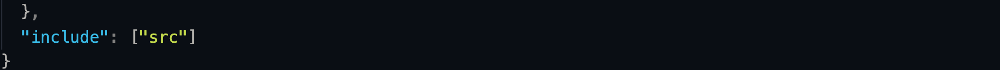

# learn-typescript
1. 编译 Typescript
```
tsc index.ts index.js
// tsc -> typescript compiler
// 两个参数 a.ts, b.js -> 编译 a.ts 文件到 b.js 文件中
// 如果 a 和 b 文件名一致时，则可以忽略第二个参数
tsc index.ts
tsc index.ts -w
// -w -> watch 监听 ts 文件的变化，并自动编译
```

2. TypeScript will check the type of a variable before compiling into js.
```js
// String
let character = 'becca';
// Number
let age = 20;
// Boolean
let isFemale = false;

// character = 20; 编辑器提醒错误
character = 'Rebecca';
// age = '231';
age = 21;
// isFemale = 'yes';
isFemale = true;

const sayHi = (name: string) => {
  return `Hi, I'm ${ name }`
}
console.log(sayHi(character));
```

3. Array & Object :wave:
```js
// Array
let friends = ['becca', 'fei', 'jasmine', 'merlin', 'chen', 'yue'];

friends = 'yue';
// let friends: string[]
// Type '"yue"' is not assignable to type 'string[]'.

// friends[1] = 12; 
// Type '12' is not assignable to type 'string'.
friends[1] = 'rebecca';

// friends.push(true);
// Argument of type 'true' is not assignable to parameter of type 'string'.
friends.push('jinwen');

let numbers = [2, 6, 8, 22, 28, 628];

// numbers.push('rebecca');
// Argument of type '"rebecca"' is not assignable to parameter of type 'number'.
// numbers.push('fei');
numbers.push(520);

let mixed = ['becca', 628, 'fei', 512, 'mom', 714]; // 混合类型：string & number

// fine
mixed.push('yue');
mixed.push(421);
mixed[0] = 22;

--------------------------------------------------

// Object
let rebecca = {
  name: 'Shuangyu',
  age: 21,
  skill: 'front-end development'
}

// fine
rebecca.name = 'becca';
rebecca.age = 23;

// rebecca.sex = 'female';
// Property 'sex' does not exist on type '{ name: string; age: number; skill: string; }'.

// rebecca.name = true;
// Type 'true' is not assignable to type 'string'.

// rebecca = 'me';
// Type '"me"' is not assignable to type '{ name: string; age: number; skill: string; }'.

// fine
rebecca = {
  name: 'yue',
  age: 22,
  skill: 'sleep'
}
```

4. Explicit Types（已经知晓定义变量未来的类型）
```js
// explicit types
let character: string;
let age: number;
let isFemale: boolean;

// character = 13;
// Type '13' is not assignable to type 'string'.
character = 'becca';
age = 21;
isFemale = true;

// Array
let friends: string[];

friends = ['becca', 'fei', 'jasmine', 'merlin', 'chen', 'yue'];
// friends.push(1);
// Argument of type '1' is not assignable to parameter of type 'string'.
friends.push('jassica');

let numbers: number[];
numbers.push(1);
numbers.push(2);
numbers.push(3);

// Union Types
let mixed: (number|string|boolean)[] = [];
// array 的话，需要使用 () 来包裹可能的类型
mixed.push('becca');
mixed.push(22);
mixed.push(false);

let uid: string|number;
// 普通数据类型不需要
uid = 'aedasdn213';
uid = 123123;

// Object
let becca: object;
becca = {
  name: 'shuangyu',
  age: 21,
  sex: 'female'
}

let becca1: {
  name: string,
  age: number,
  skill: string[]
};

becca1 = {
  name: 'shuangyu',
  age: 22,
  skill: ['front-end development', 'sleep']
}
```

5. Any（谨慎使用）
```js
// Any
let dontKnow: any;
dontKnow = true;
dontKnow = 'becca';
dontKnow = 12;
dontKnow = [12, 2, 2];
dontKnow = { name: 'woo' };

let mixed: any[] = [];
mixed.push('becca');
mixed.push(28);
mixed.push(false);
mixed.push({});

let stranger: {
  name: any,
  age: any
}

stranger = {
  name: 'becca',
  age: 22
}
console.log(stranger);

stranger = {
  name: 22,
  age: 'becca'
}
console.log(stranger);
```

6. TypeScriptCompile 配置


项目目录下增加 ```tsconfig.json``` 配置文件。
- 整理项目文件，新建 ```public``` 文件夹，放置部署文件如 ```index.html``` ```sandbox.js``` ```style.css``` 等
- 新建 ```src``` 文件夹，放置源码文件如 ```sandbox.ts```
- 目标：改变 ts 编译规则，监听 ```src``` 文件夹中的所有 ```.ts``` 文件并将其编译输出到 ```public``` 文件夹中
  - 修改 ```tsconfig.json``` 文件中的配置
  
  

  文件最后添加：

  

- 现在只需在命令行中执行命令 ```$ tsc -w``` 就可以自动监听 src 文件夹中所有的 ```.ts``` 文件并编译成 ```.js``` 文件到 ```public``` 文件夹中了。